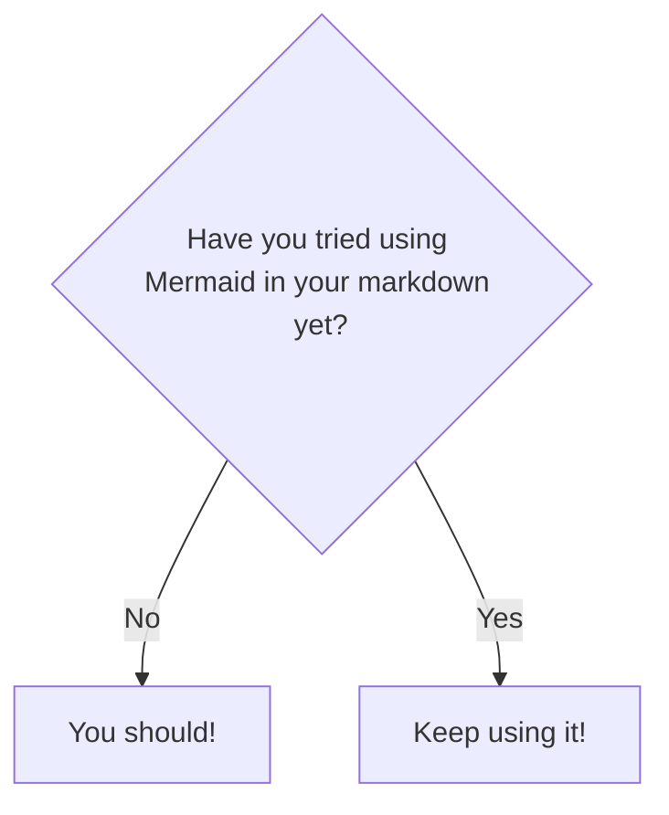

## Portfolio Website 
This is my portfolio website. I use HTML and CSS. My aim is to keep my portfolio very simple when it comes to both design and engineering.

Damn it Jim, I'm a game developer not a web developer!

